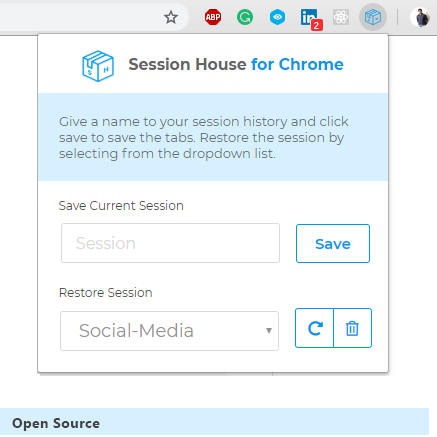

# Session-House-Chrome-Extension

A simple efficient chrome extension to save and restore tabs.

## Getting Started



### Prerequisites

To run the project:
```
Clone the repository 

Go to chrome://extensions 

enable 'Developer Mode' on upper right 

click the load unpackaged 

Select the project
```
